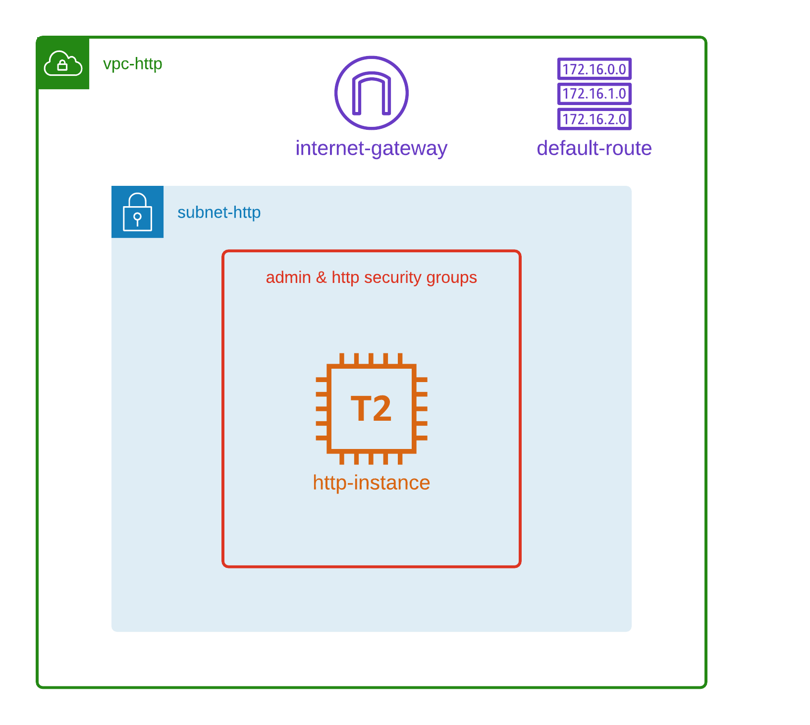

# How to



### Create stack

Install Python package requirements:
```
python -m venv ./venv
source ./venv/bin/activate
pip install -r requirements.txt
```

Deploy stack:

```
pulumi up
```

This script will create:
- 1 vpc
- 1 subnet
- 1 route_table
- 1 internet gateway
- 2 security groups
- 1 instance

### Delete stack

```
pulumi destroy
```
